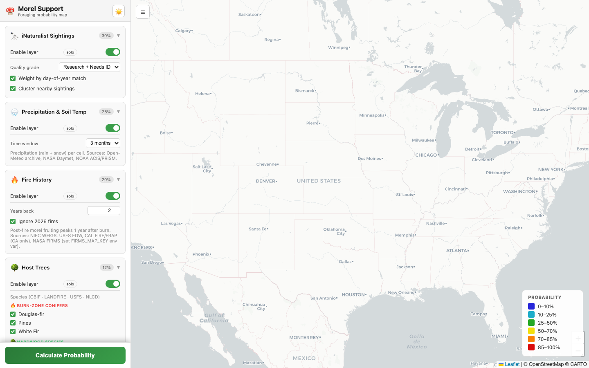
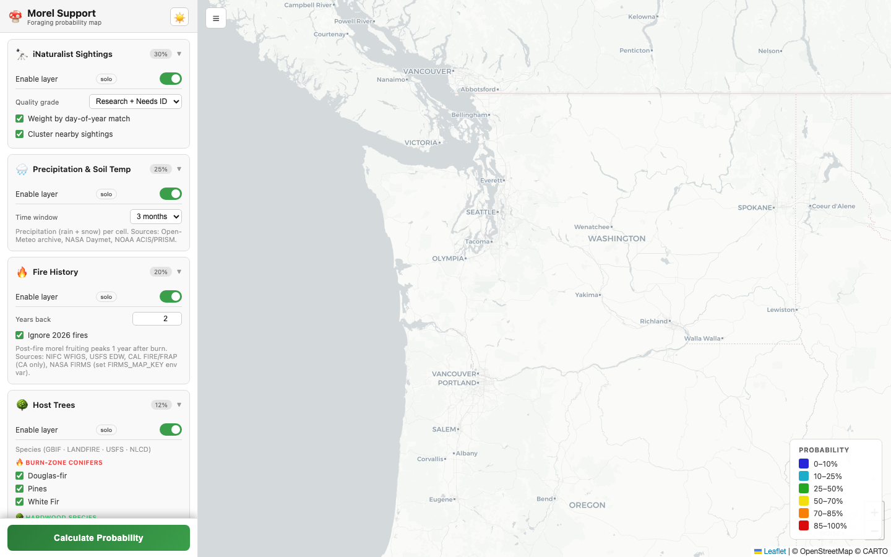
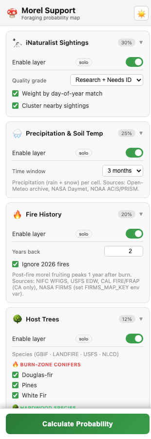
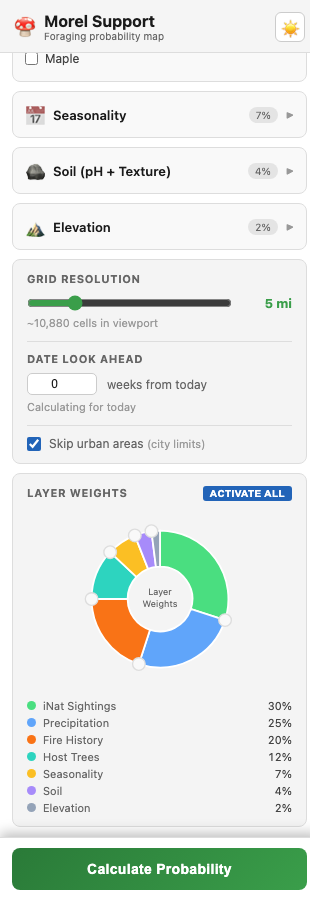
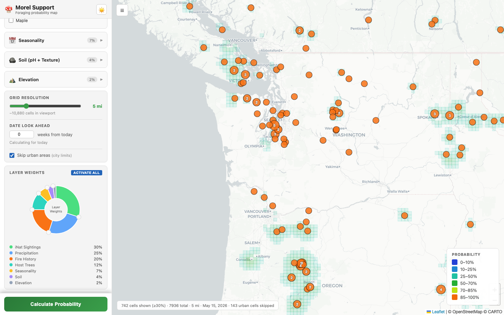
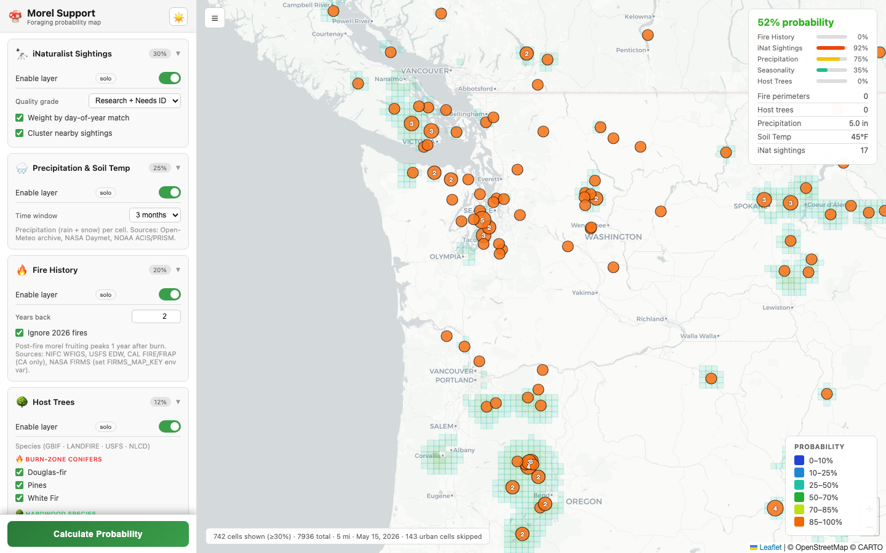

```
 ███╗   ███╗ ██████╗ ██████╗ ███████╗██╗
 ████╗ ████║██╔═══██╗██╔══██╗██╔════╝██║
 ██╔████╔██║██║   ██║██████╔╝█████╗  ██║
 ██║╚██╔╝██║██║   ██║██╔══██╗██╔══╝  ██║
 ██║ ╚═╝ ██║╚██████╔╝██║  ██║███████╗███████╗
 ╚═╝     ╚═╝ ╚═════╝ ╚═╝  ╚═╝╚══════╝╚══════╝

 ███████╗██╗   ██╗██████╗ ██████╗  ██████╗ ██████╗ ████████╗
 ██╔════╝██║   ██║██╔══██╗██╔══██╗██╔═══██╗██╔══██╗╚══██╔══╝
 ███████╗██║   ██║██████╔╝██████╔╝██║   ██║██████╔╝   ██║
 ╚════██║██║   ██║██╔═══╝ ██╔═══╝ ██║   ██║██╔══██╗   ██║
 ███████║╚██████╔╝██║     ██║     ╚██████╔╝██║  ██║   ██║
 ╚══════╝ ╚═════╝ ╚═╝     ╚═╝      ╚═════╝ ╚═╝  ╚═╝   ╚═╝
```

> **A multi-layer probability map for morel mushroom foraging — web app + native iOS.**

---

## What it does

Morel Support combines seven real-time data sources to score every grid cell on the map from 0–100% for morel likelihood. Pan to any area, hit **Calculate**, and see a heat map colored by probability.

```
┌─────────────────────────────────────────────────────────────┐
│  Data Sources          Scoring Layers         Output        │
│                                                             │
│  iNaturalist ────────► iNat sightings ──┐                  │
│  Open-Meteo  ──┐                        │                  │
│  NASA Daymet ──┼──────► Precipitation ──┤                  │
│  NOAA PRISM  ──┘                        │                  │
│  NIFC WFIGS  ──┐                        ├──► Weighted ───► │
│  USFS EDW    ──┼──────► Fire perimeters ┤    Average       │
│  CAL FIRE    ──┘                        │    (0–100%)      │
│  GBIF        ──┐                        │                  │
│  LANDFIRE    ──┼──────► Host trees ─────┤                  │
│  USFS TreeMap──┘                        │                  │
│  OpenTopoData ────────► Elevation ──────┤                  │
│  SoilGrids ISRIC ─────► Soil pH/texture ┤                  │
│  Lat + Date ──────────► Seasonality ────┘                  │
└─────────────────────────────────────────────────────────────┘
```

---

## Table of Contents

- [How the scoring works](#how-the-scoring-works)
- [Installation — Web App](#installation--web-app)
- [Installation — iOS App](#installation--ios-app)
- [Usage Tutorial](#usage-tutorial)
- [Layer Reference](#layer-reference)
- [Data Sources & Citations](#data-sources--citations)

---

## How the scoring works

Each grid cell gets an independent score (0–1) for each enabled layer. Those scores are combined into a single probability using a weighted average:

```
P = Σ(score_i × weight_i) / Σ(weight_i)
```

**Default weights:**

```
iNat sightings  ████████████████████░░░░░░░░░░░░  30%
Precipitation   ████████████████░░░░░░░░░░░░░░░░  25%
Fire perimeters █████████████░░░░░░░░░░░░░░░░░░░  20%
Host trees      ████████░░░░░░░░░░░░░░░░░░░░░░░░  12%
Seasonality     █████░░░░░░░░░░░░░░░░░░░░░░░░░░░   7%
Soil quality    ███░░░░░░░░░░░░░░░░░░░░░░░░░░░░░   4%
Elevation       ██░░░░░░░░░░░░░░░░░░░░░░░░░░░░░░   2%
```

You can drag the pie chart in the sidebar to adjust weights in real time.

**Burn-zone boost:** When Douglas fir, pine, or white fir observations fall within 8 miles of a fire perimeter that scores above 15%, both the fire and tree scores are multiplied (1.55× and 1.45× respectively), reflecting the well-documented post-fire morel flush.

**Post-fire age curve:**

```
Score
1.00 │        ██
0.85 │      ████
0.70 │  ██ ██████
0.60 │  █████████
0.40 │ ██████████
0.35 │ ██████████
0.15 │ ██████████ ██
     └────────────────────
      0  1  2  3  4  5+ years after fire
```

---

## Installation — Web App

### Requirements

- Python 3.10 or newer
- pip

### Step 1 — Clone the repository

```bash
git clone https://github.com/your-username/morel-support.git
cd morel-support
```

### Step 2 — Create a virtual environment

```bash
python3 -m venv .venv
source .venv/bin/activate      # macOS / Linux
# .venv\Scripts\activate       # Windows
```

### Step 3 — Install dependencies

```bash
pip install -r requirements.txt
```

The only two direct dependencies are:

| Package | Purpose |
|---|---|
| `flask` | Web server and API |
| `global-land-mask` | Filter ocean cells out of the grid |

### Step 4 — (Optional) Set the NASA FIRMS key

If you have a free NASA FIRMS API key, real-time MODIS fire hotspot detections are added on top of the official perimeter sources:

```bash
export FIRMS_MAP_KEY="your_key_here"
```

Get a key at [firms.modaps.eosdis.nasa.gov](https://firms.modaps.eosdis.nasa.gov/api/area/).

### Step 5 — Run the app

```bash
python app.py
```

The server starts on port **8081** and opens your browser automatically:

```
🍄  Morel Support →  http://localhost:8081
```

---

## Installation — iOS App

### Requirements

- Xcode 15 or newer
- iOS 17 simulator or a physical device running iOS 17+

### Step 1 — Open the project

```bash
open ios/Morel_Support_iOS.xcodeproj
```

### Step 2 — Select a target

In Xcode, choose your simulator or connected device from the scheme picker at the top of the window.

### Step 3 — Build and run

Press `⌘R`. The app fetches all layer data directly from public APIs — no backend server is required.

> **Note:** The iOS app implements scoring entirely on-device in Swift. The Python web server and the iOS app are independent — you do not need to run the Python backend to use the iOS app.

---

## Usage Tutorial

### Web app

#### 1. Open the app

Run `python app.py` and the browser opens automatically at `http://localhost:8081`. You'll see the full-screen map with the layer sidebar on the left.



#### 2. Navigate to your target area

Pan and zoom to the region you want to survey. A tighter viewport means fewer cells and faster results — a 200-mile-wide area at 5 mi resolution generates roughly 1,000–2,000 cells.



#### 3. Configure layers in the sidebar

Each card in the sidebar controls one data layer. Toggle layers on/off with the switch on the right. Use **solo** to view only that layer's raw data on the map — useful for ground-truthing what the APIs are returning.



Key options per layer:

| Layer | Notable options |
|---|---|
| **iNat** | Quality grade filter; seasonal weighting on/off |
| **Precipitation** | Time window (`1w`, `2w`, `1m`, `3m`) |
| **Fire History** | Years back (1–5); ignore current-year fires |
| **Host Trees** | Species checkboxes (burn-zone conifers vs hardwoods) |
| **Seasonality** | No options — pure lat/date calculation |
| **Soil / Elevation** | Enable/disable only |

#### 4. Adjust layer weights

Scroll the sidebar down to the **Layer Weights** pie chart. Drag any slice to redistribute scoring weight between layers in real time. The percentages update as you drag. Changes take effect on the next Calculate run.



Other settings below the chart:

- **Grid resolution** — cell size in miles (1–20 mi). Finer = slower, more detail.
- **Date look-ahead** — shift the target date forward (weeks). Use 2–4 weeks to preview upcoming conditions.
- **Skip urban areas** — removes cells within city/town radii sourced from OpenStreetMap.

#### 5. Hit Calculate

Click **Calculate Probability** at the bottom of the sidebar. The app fetches all enabled layers in parallel, then scores every grid cell. Results appear as colored squares on the map.



Color scale (bottom-right legend):

| Color | Probability |
|---|---|
| Dark green | ≥ 75% — high |
| Teal | 50–74% — moderate |
| Yellow | 25–49% — low |
| Gray | < 25% — very low |

iNaturalist sightings (orange pins) and fire perimeters (red polygons) are overlaid automatically when those layers are enabled.

#### 6. Read the cell detail panel

Hover over or click any grid cell to open the detail panel in the top-right corner of the map. It shows the overall probability, a per-layer score breakdown, and the raw data values that drove the score.



---

### iOS app

1. **Launch** the app. The map opens centered on the Sierra Nevada.
2. **Pan and zoom** to your target area.
3. **Toggle layers** using the chip row at the bottom of the screen (tap a chip to enable/disable).
4. Tap the **gear icon** (top right) to open Settings — adjust resolution, lookahead weeks, urban filter, and weights from the pie chart.
5. Tap **Calculate** (large green button). A progress bar tracks fetching and scoring.
6. Tap any colored grid cell to see its full breakdown in a slide-up detail sheet.

---

## Layer Reference

### iNaturalist Sightings

Fetches all *Morchella* genus observations from the iNaturalist API within the viewport. Observations with obscured locations or geoprivacy set are excluded. Each sighting is scored by:

- **Distance** from cell center (max 25 miles, power curve)
- **Seasonal alignment** — sightings near the same day-of-year as the target date score higher
- **Recency** — older observations are down-weighted by 8% per year

### Precipitation

Pulls recent rainfall from three sources and blends them per grid cell:

- **Open-Meteo Archive API** — precipitation + snowfall + 0–7 cm soil temperature
- **NASA Daymet** — independent daily gridded precipitation (CONUS + southern Canada)
- **NOAA ACIS / PRISM** — 4 km gridded precipitation from the PRISM Climate Group

Scoring curve:

| Rainfall (past window) | Score |
|---|---|
| < 0.2 in | 0.05 — too dry |
| 0.5–1.0 in | 0.60 — promising |
| 1.0–2.0 in | 0.85 — good |
| 1.0–3.5 in | 1.00 — ideal |
| > 6.0 in | 0.45 — waterlogged |

Soil temperature (0–7 cm depth) is blended at 45% weight alongside precipitation:

| Soil temp | Score |
|---|---|
| 50–60 °F | 1.00 — optimal |
| 42–50 °F | 0.75 — early season |
| 68–78 °F | 0.25 — too warm |

### Fire Perimeters

Pulls historical and current fire perimeters from:

- **NIFC WFIGS** — interagency fire perimeters (current + year-to-date + historical)
- **USFS EDW** — MTBS mapped fire perimeters (1984–present)
- **CAL FIRE / FRAP** — California-specific per-year perimeters + live incident CSV
- **NASA FIRMS** — MODIS satellite hotspot detections (requires `FIRMS_MAP_KEY`)

Each fire is scored by age (peak at 1 year post-burn). Nearby fires not directly overlapping a cell still contribute a proximity score, falling to zero at 20 miles from the perimeter edge.

### Host Trees

Species scored by known morel association:

| Species | Score |
|---|---|
| Ash | 0.90 |
| Elm | 0.85 |
| Tulip poplar | 0.80 |
| Cottonwood | 0.70 |
| Douglas fir* | 0.70 |
| Oak | 0.65 |
| White fir* | 0.65 |
| Sycamore | 0.65 |
| Pine* | 0.60 |

\* Burn-zone species — receive a 1.45× boost when near active fire perimeters.

Sources: **GBIF** species occurrences, **LANDFIRE EVT** vegetation types, **USFS TreeMap 2016**, **NLCD 2019** land cover.

### Elevation

Pulled from **OpenTopoData (NED 10m)**. Scoring curve:

| Elevation | Score |
|---|---|
| 600–1,500 ft | 1.00 — ideal |
| 1,500–3,000 ft | 0.90 — excellent |
| 3,000–5,000 ft | 0.55 — good, later season |
| < 300 ft | 0.30 — valley floor |
| > 8,000 ft | 0.10 — too high |

### Soil

Pulled from **SoilGrids ISRIC** at 5–15 cm depth. pH scoring:

| pH | Score |
|---|---|
| 6.0–7.0 | 1.00 — optimal |
| 7.0–7.5 | 0.85 |
| 5.5–6.0 | 0.65 |
| < 4.5 | 0.10 — too acidic |

### Seasonality

A pure calculation — no network call required. Estimates peak morel day-of-year based on latitude:

```
peak_day ≈ 70 + (latitude − 30) × 2.5

Examples:
  30°N → ~day 70  (Mar 11)
  38°N → ~day 90  (Mar 31)
  45°N → ~day 107 (Apr 17)
  50°N → ~day 120 (Apr 30)
```

---

## Data Sources & Citations

| Source | Data | URL |
|---|---|---|
| **iNaturalist** | *Morchella* observations | https://api.inaturalist.org/v1/ |
| **Open-Meteo** | Archive precipitation, snowfall, soil temperature | https://archive-api.open-meteo.com/ |
| **NASA Daymet** | Gridded daily precipitation (CONUS + Canada) | https://daymet.ornl.gov/ |
| **NOAA ACIS / PRISM Climate Group** | 4 km gridded precipitation | http://data.rcc-acis.org/ |
| **NIFC WFIGS** | Interagency wildfire perimeters | https://services3.arcgis.com/T4QMspbfLg3qTGWY/ |
| **USFS EDW — MTBS** | Monitoring Trends in Burn Severity perimeters | https://apps.fs.usda.gov/arcx/rest/services/EDW/ |
| **CAL FIRE / FRAP** | California fire perimeters | https://services1.arcgis.com/jUJYIo9tSA7EHvfZ/ |
| **CAL FIRE Incident CSV** | Live California incident data | https://incidents.fire.ca.gov/imapdata/mapdataall.csv |
| **NASA FIRMS** | MODIS C6.1 fire hotspot detections | https://firms.modaps.eosdis.nasa.gov/ |
| **GBIF** | Species occurrence records | https://api.gbif.org/v1/ |
| **LANDFIRE EVT** | Existing Vegetation Type (CONUS) | https://lfps.usgs.gov/ |
| **USFS TreeMap 2016** | Forest stand-level tree data | https://apps.fs.usda.gov/arcx/rest/services/EDW/ |
| **NLCD 2019** | National Land Cover Database | https://landscape2.arcgis.com/ |
| **OpenTopoData** | NED 10m elevation (CONUS) | https://api.opentopodata.org/ |
| **SoilGrids ISRIC** | Global soil pH and clay content | https://rest.isric.org/soilgrids/ |
| **OpenStreetMap / Overpass API** | Urban place nodes for exclusion filter | https://overpass-api.de/ |
| **global-land-mask** | Ocean / land classification | https://github.com/toddkarin/global-land-mask |

### Scientific references

- Pilz, D. et al. (2007). *Ecology and management of morels harvested from the forests of western North America.* USDA Forest Service General Technical Report PNW-GTR-710.
- Pilz, D., & Molina, R. (2002). *Commercial mushroom harvesting, marketing, and management in forests of the Pacific Northwest.* USDA Forest Service General Technical Report PNW-GTR-534.
- Winder, R.S. et al. (2020). Post-wildfire morel (*Morchella*) fruiting: observations on abundance and spatial distribution. *Botany*, 98(3), 133–145.
- PRISM Climate Group, Oregon State University. (2014). PRISM gridded climate data. https://prism.oregonstate.edu

---

## Architecture

```
morel-support/
├── app.py              ← Flask app: routes and /api/calculate
├── config.py           ← CPU/thread-pool constants
├── grid.py             ← Bounding-box grid generator (land-only)
├── scoring.py          ← Per-cell scoring worker (runs in process pool)
├── cache.py            ← In-process TTL cache (layer data + results)
├── urban.py            ← OSM Overpass urban-exclusion filter
├── utils.py            ← haversine distance, fetch_json with retry
├── layers/
│   ├── base.py         ← BaseLayer abstract class
│   ├── inat.py         ← iNaturalist fetch + score
│   ├── precipitation.py← Open-Meteo / Daymet / ACIS fetch + score
│   ├── fires.py        ← WFIGS / USFS / CAL FIRE / FIRMS fetch + score
│   ├── trees.py        ← GBIF / LANDFIRE / TreeMap / NLCD fetch + score
│   ├── elevation.py    ← OpenTopoData fetch + score
│   ├── soil.py         ← SoilGrids fetch + score
│   └── season.py       ← Seasonality score (no network call)
├── templates/
│   └── index.html      ← Leaflet.js web frontend
└── ios/
    └── Morel_Support_iOS/
        ├── App/        ← SwiftUI entry point and ContentView
        ├── Layers/     ← Swift re-implementations of each layer
        ├── Services/   ← Network, grid, urban filter, scoring engine
        ├── ViewModels/ ← MapViewModel (orchestrates fetch + score)
        └── Views/      ← Map, bottom sheet, pie weight chart
```

**Concurrency model:**

```
HTTP fetch phase          Scoring phase
(I/O bound)               (CPU bound)

ThreadPoolExecutor   →    ProcessPoolExecutor
  inat fetch ──────┐        worker: cell 0 ──┐
  precip fetch ────┤        worker: cell 1 ──┤──► GeoJSON
  fires fetch ─────┤        worker: cell 2 ──┤    response
  trees fetch ─────┤           ...           │
  elevation fetch ─┘        worker: cell N ──┘
  soil fetch ──────┘
```

---

## License

MIT
